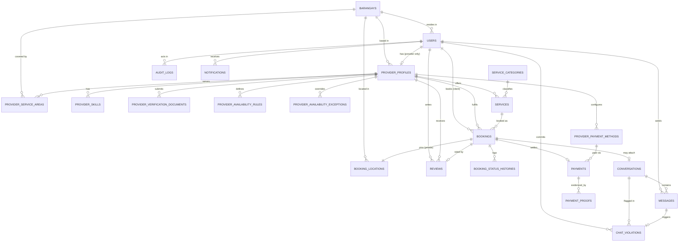

# WEBIS — Phase 0: Requirements Audit & Architecture Proposal

**Project:** WEBIS — Web-Based Platform for Independent Service Providers
**Thesis:** *Design and Development of a Web-Based Platform for Independent Service Provider* — Bartolome, Cacha, Carienena · Cavite State University–CCAT Campus, Rosario, Cavite
**Source document audited:** `CAPSTONE chapter 1-3.docx` (Chapters I–III + partial Chapter IV/V template)
**Audit date:** 2026-09-08
**Status:** ⛔ **Awaiting approval — no implementation code written yet**

---

## 0. How to read this document

This is the Phase 0 deliverable. It contains nine sections mandated by the build brief:

| § | Deliverable |
|---|---|
| 1 | Source-of-truth summary (what the thesis actually says) |
| 2 | Requirements Matrix |
| 3 | Actor Matrix |
| 4 | Feature Matrix (with scope classification) |
| 5 | Identified thesis contradictions & documentation defects |
| 6 | Proposed final architecture |
| 7 | Database entity list + ERD proposal |
| 8 | API module list |
| 9 | Folder architecture + implementation roadmap |
| 10 | Open questions requiring your decision |

Nothing in §5 has been "silently fixed." The thesis has **not** been rewritten. §5 is a technical note listing what should later be corrected in the manuscript, with a recommended correction for each item.

---

## 1. Source-of-truth summary

### 1.1 What the thesis explicitly commits to

**General objective** — Design and development of a web-based platform for independent service providers.

**Specific objectives (verbatim structure):**

1. Identify and analyze the common challenges faced by independent solo service providers and residents in locating reliable services.
2. Design the platform with **four (4) major features**:
   - a. User Registration and Verification System
   - b. Service Posting and Location-Based Filtering
   - c. Time Slot-Based Booking and Communication System
   - d. Rating, Feedback, and Admin Dashboard System
3. Develop using **PHP, MySQL, JavaScript, HTML5**.
4. Test via unit, integration, functional, and/or system testing.
5. Evaluate using the adapted **ISO/IEC 25010** software and data quality instrument.
6. Prepare an implementation plan.

**Nine (9) functional modules** (Requirement Documentation, p. 10):

1. User Registration and Login
2. Service Provider Profile Management
3. Service Listing
4. Provider Search and Matching
5. Booking and Scheduling
6. Verification
7. Communication and Messaging
8. Ratings and Feedback
9. Administration and Monitoring

**Methodology:** Evolutionary Prototyping Model (Bjarnason, Lang & Mjöberg, 2023) — Analysis → Design → Development, iterative.

**Design-phase stack (verbatim):** "the React JS frontend, Laravel backend, and MySQL database"; VS Code, Laragon, Git; Figma for wireframes.

**Setting:** PESO Tanza, Cavite, Philippines (2026–2027). Barangay examples throughout are Tanza barangays (Amaya 1, Amaya 2, Sahud-Ulan).

**Evaluation instrument:** ISO/IEC 25010:2023 characteristics as tabulated — Functional Suitability, Performance Efficiency, Compatibility, Interaction Capability, Reliability, Security, Maintainability, Flexibility, Safety. Mean interpretation scale 1.50–5.00.

### 1.2 What the thesis explicitly excludes (Scope and Limitation, p. 3)

These are hard constraints. Building past them without amending the manuscript creates a defense liability.

| Area | Documented limitation |
|---|---|
| Verification | "does not include advanced verification processes such as government ID validation, biometric authentication, or background checks" — basic identity validation only |
| Location | "limited to basic location detection using manually inputted location data or device-based location services… does not support… real-time GPS tracking, route optimization, or integration with advanced mapping APIs beyond basic filtering" |
| Booking | "does not support automated scheduling optimization, conflict prediction using AI, or integration with external calendar systems such as Google Calendar" |
| Communication | "limited to in-app messaging and does not include voice or video call functionality" |
| Ratings | "purely user-based and do not include advanced fraud detection or sentiment analysis" |
| Admin | "limited to basic monitoring, reporting, and user management functions and does not include predictive analytics, automated dispute resolution, or advanced decision-support systems" |
| Overall | "does not extend to mobile application development, **payment gateway integration**, or advanced AI-driven automation" |

### 1.3 Supplied UI references

Four high-fidelity mockups were provided (Landing Page, Login Module, Client Dashboard, Provider Dashboard). Extracted design language — this becomes the binding design system in §6.4:

- Deep navy sidebar/hero `#0F2557`–`#12295C`; page background `#F1F3F9`; white cards
- Accent orange `#F5811F` for the wordmark's second half, primary CTAs, and search button
- Status pills: amber = Pending, green = Confirmed, blue = Ongoing; green Accept / red Reject action pairs
- Sidebar nav with role badge under the avatar; red unread count on Messages; red Logout pinned to the bottom
- Three KPI stat cards above a single primary list card
- Wordmark: "WEBIS" navy + "System" orange, sub-label "Provider Portal" / "Client Portal"

---

## 2. Requirements Matrix

Legend — **Source:** OBJ = specific objective · MOD = documented module · SCP = scope statement · UC = use-case narrative · BRF = build brief only (not in thesis).
**Class:** ✅ In documented scope · ⚠️ Interpretation required · 🔶 Beyond documented scope — needs manuscript amendment (see §5.B).

| # | Requirement | Source | Class | Implementation | Phase |
|---|---|---|---|---|---|
| R-01 | Client / Provider / Admin registration | OBJ2a, MOD1, UC | ✅ | Laravel + Sanctum, role enum | P3 |
| R-02 | Secure login, hashed passwords, logout | OBJ2a, MOD1, UC | ✅ | bcrypt, token auth | P3 |
| R-03 | Email verification | SCP ("standard… such as email verification") | ✅ | Laravel `MustVerifyEmail` | P3 |
| R-04 | Password reset | Implied by MOD1 | ⚠️ | Laravel password broker | P3 |
| R-05 | Role-based access control | UC (3 distinct actors) | ✅ | Policies + middleware | P3 |
| R-06 | Account activation / suspension | Purpose ¶ "account management tools" | ✅ | `users.status` + admin action | P9 |
| R-07 | Provider profile: skills, experience, services, contact | MOD2 | ✅ | `provider_profiles` | P4 |
| R-08 | Profile photo upload | Purpose ¶ "showcase their skills" | ⚠️ | Validated image upload | P4 |
| R-09 | Provider verification: submit documents, admin approve/reject | MOD6, UC | ⚠️ **conflict** | See §5.A-4 — recommend document-upload review, **no** government-ID matching | P4 |
| R-10 | Verified-provider gate on publishing services | Purpose ¶ "admin verification" | ✅ | Policy on `services.publish` | P4 |
| R-11 | Service categories managed by admin | MOD9, UC | ✅ | `service_categories` CRUD | P4 |
| R-12 | Provider creates/edits/deactivates service listings | MOD3, OBJ2b | ✅ | `services` CRUD, soft delete | P4 |
| R-13 | Pricing set by provider "within an approved range" | Purpose ¶ | ⚠️ | Optional per-category min/max price guard — see Q-4 | P4 |
| R-14 | Client search by service type | MOD4, OBJ2b | ✅ | Backend keyword search | P4 |
| R-15 | Location-based filtering by barangay | OBJ2b, SCP | ✅ | `barangays` table, indexed FK | P4 |
| R-16 | Filter by availability, ratings, "other relevant criteria" | MOD4 | ✅ | Query-builder filters | P4 |
| R-17 | Sort: nearest / rating / price / most-booked / newest | BRF (MOD4 "matching") | ⚠️ | Haversine distance, server-side | P4 |
| R-18 | Provider public profile page | UC "view provider profiles" | ✅ | Public API resource, redacted | P4 |
| R-19 | Time-slot availability defined by provider | OBJ2c, MOD5 | ✅ | Weekly rules + date exceptions | P5 |
| R-20 | Client books a specific date + time slot | OBJ2c, MOD5, UC | ✅ | `bookings` | P5 |
| R-21 | Booking conflict prevention | Purpose ¶ "automated booking conflict prevention" | ✅ | DB transaction + overlap check | P5 |
| R-22 | Provider accept / reject booking | UC | ✅ | Guarded state transition | P5 |
| R-23 | Booking status lifecycle + history | UC "update service status" | ✅ | Enum + `booking_status_histories` | P5 |
| R-24 | Cancellation with reason | Implied by MOD5 testing ("canceling appointments") | ✅ | Guarded transition | P5 |
| R-25 | Exact service-location pin on a map | BRF | 🔶 | Leaflet + OSM tiles, manual pin + browser geolocation — see §5.B-1 | P5 |
| R-26 | Exact coordinates hidden until booking accepted | BRF (privacy) | 🔶 | Separate table + policy; barangay-only before acceptance | P5 |
| R-27 | In-app client↔provider messaging | OBJ2c, MOD7, SCP | ✅ | `conversations` + `messages` | P6 |
| R-28 | Unread counts, read state, conversation list | MOD7 | ✅ | Denormalised counters | P6 |
| R-29 | Conversation may attach to a booking | BRF | ⚠️ | Nullable `booking_id` | P6 |
| R-30 | Deterministic chat content filtering (off-platform contact) | BRF | 🔶 | Regex/normalisation rules — see §5.B-2 | P6 |
| R-31 | Chat violation logging + admin moderation queue | BRF | 🔶 | `chat_violations` | P6 |
| R-32 | Payment recording & "view payment records" | UC | ⚠️ **conflict** | See §5.A-2 | P7 |
| R-33 | QR Ph payment + proof upload + manual verification | BRF | 🔶 | No gateway API — manual proof workflow keeps SCP's "no payment gateway integration" true | P7 |
| R-34 | Client rates provider 1–5 + written feedback after completion | OBJ2d, MOD8, UC | ✅ | `reviews`, unique per booking | P8 |
| R-35 | Rating only after a completed booking | MOD8 ("after service completion") | ✅ | Policy check | P8 |
| R-36 | Average rating, review count, distribution | Purpose ¶ "star rating features" | ✅ | Cached aggregates | P8 |
| R-37 | Admin: manage user accounts | OBJ2d, MOD9, UC | ✅ | Admin CRUD + audit | P9 |
| R-38 | Admin: verify service providers | MOD6, MOD9, UC | ✅ | Verification queue | P9 |
| R-39 | Admin: monitor bookings & payments | UC | ✅ | Admin listings | P9 |
| R-40 | Admin: generate reports | UC "generating reports" | ✅ | Exportable summaries | P9 |
| R-41 | Admin dashboard analytics (DB-driven) | OBJ2d | ✅ | Aggregate queries + Recharts | P9 |
| R-42 | Audit logging of admin actions | BRF (supports ISO "Accountability"/"Non-repudiation") | 🔶 | `audit_logs` — justified by §1.1 evaluation instrument | P9 |
| R-43 | In-app notifications | Purpose ¶ "notifications" (Req. Analysis ¶3) | ✅ | Laravel notifications table | P5–P9 |
| R-44 | Responsive web UI (desktop/laptop/tablet/phone browser) | Def. of Terms "Web-Based" | ✅ | Tailwind responsive | P10 |
| R-45 | Unit / integration / functional / system tests | OBJ4 | ✅ | PHPUnit + Vitest, plus Table 6 test-case matrix | P11 |
| R-46 | ISO/IEC 25010 evaluation support | OBJ5 | ✅ | Deliver the instrument + seeded demo data | P11–P12 |
| R-47 | Implementation plan | OBJ6 | ✅ | Already in Table 5; deployment doc | P12 |

**Coverage:** 47 requirements. 33 fully inside documented scope, 8 needing an interpretation decision, 6 beyond documented scope (all flagged in §5.B with a recommended manuscript amendment).

---

## 3. Actor Matrix

| Capability | Guest | Client | Provider (unverified) | Provider (approved) | Admin |
|---|---|---|---|---|---|
| Browse landing page, categories | ✔ | ✔ | ✔ | ✔ | ✔ |
| Search services / providers | ✔ | ✔ | ✔ | ✔ | ✔ |
| View public provider profile (barangay-level only) | ✔ | ✔ | ✔ | ✔ | ✔ |
| Register | ✔ | — | — | — | — |
| Manage own profile | — | ✔ | ✔ | ✔ | ✔ |
| Submit verification documents | — | — | ✔ | ✔ (re-submit) | — |
| Create / edit services | — | — | ✘ (blocked) | ✔ | — |
| Publish service to search index | — | — | ✘ | ✔ | — |
| Define availability slots | — | — | ✔ (no effect) | ✔ | — |
| Create booking | — | ✔ | — | — | — |
| Accept / reject booking | — | — | — | ✔ (own only) | — |
| Cancel booking | — | ✔ (own, pre-start) | — | ✔ (own, with reason) | ✔ (dispute) |
| Advance status to IN_PROGRESS / COMPLETED | — | — | — | ✔ (own only) | — |
| See **exact** service coordinates | — | ✔ (own booking) | — | ✔ (own **accepted** booking) | ✔ (logged access) |
| Start a conversation | — | ✔ | — | ✔ | — |
| Send messages | — | ✔ | ✔ | ✔ | — |
| Read another user's conversation | — | ✘ | ✘ | ✘ | ✘ (only flagged msgs) |
| Configure QR payment method | — | — | ✔ | ✔ | — |
| Submit payment + proof | — | ✔ | — | — | — |
| Verify / reject payment | — | — | — | ✔ (own bookings) | ✔ (override, logged) |
| Leave review | — | ✔ (own completed booking, once) | — | — | — |
| Reply to a review | — | — | — | ✔ (own) | — |
| Manage users / suspend accounts | — | — | — | — | ✔ |
| Approve / reject provider verification | — | — | — | — | ✔ |
| Manage categories & barangays | — | — | — | — | ✔ |
| Review chat violations | — | — | — | — | ✔ |
| View analytics & audit logs | — | — | — | — | ✔ |
| Change any user's role | — | ✘ | ✘ | ✘ | ✔ (logged) |

**Hard rule:** every ✘ and every "own only" in this table becomes a Laravel **Policy** method and a **Feature test**. Frontend route guards are cosmetic only.

---

## 4. Feature Matrix

Mapping the thesis's 4 major features → 9 modules → build phases. This mapping is what reconciles OBJ2 (4 features) with the Requirement Documentation (9 modules) — see §5.A-6.

| Thesis major feature (OBJ2) | Modules covered | Phases |
|---|---|---|
| **a.** User Registration and Verification System | M1 Registration & Login · M2 Provider Profile · M6 Verification | P3, P4 |
| **b.** Service Posting and Location-Based Filtering | M3 Service Listing · M4 Provider Search & Matching | P4 |
| **c.** Time Slot-Based Booking and Communication System | M5 Booking & Scheduling · M7 Communication & Messaging | P5, P6 |
| **d.** Rating, Feedback, and Admin Dashboard System | M8 Ratings & Feedback · M9 Administration & Monitoring | P8, P9 |
| *(supporting, not a thesis feature)* | Payments · Notifications · Audit | P7, P9 |

---

## 5. Identified contradictions and documentation defects

### 5.A — Internal contradictions inside the thesis

> These are conflicts **within the manuscript itself**. Each needs a decision and a manuscript edit, independent of the software.

**A-1. Technology stack: Objective 3 vs. Methodology.**
Objective 3 lists *PHP, MySQL, JavaScript, HTML5*. The Design and Development Phases specify *React JS + Laravel + MySQL*.
*Assessment:* These are **reconcilable, not contradictory** — Laravel **is** PHP, React **is** JavaScript, and React renders HTML5. The manuscript simply states the layer at two different levels of abstraction.
**Recommended manuscript edit:** rewrite Objective 3 as *"PHP (Laravel 11 framework); JavaScript (React 18 with Vite); HTML5 and CSS3 (Tailwind CSS); MySQL 8 database management system."* No code impact.

**A-2. Payments: Scope says excluded, Use Case says included.**
Scope: *"does not extend to… payment gateway integration."* Use-case narrative: client can *"make payments"*; provider can *"view payment records"*; Definition of Terms defines **Payment**.
*Assessment:* Both can be true. "Payment **gateway** integration" = a third-party API (PayMongo, Stripe, GCash API) that moves money. A **QR Ph + uploaded proof + manual verification** workflow moves no money through the system — WEBIS only *records* an off-platform transfer.
**Recommended manuscript edit:** in Scope, change to *"does not extend to automated payment gateway integration; payment is handled through QR-code-based manual settlement with proof-of-payment recording and administrator verification."* This makes the Use Case, the Definition of Terms and the Scope agree. **This is the single most important edit in this document.**

**A-3. Location: Scope's mapping limitation vs. location-based filtering + "nearest" sorting.**
Scope permits *"manually inputted location data or device-based location services"* and forbids *"integration with advanced mapping APIs beyond basic filtering."*
*Assessment:* An interactive Leaflet map with a draggable pin is **manual location input with a visual control** plus the **browser Geolocation API** (explicitly a device-based location service). OpenStreetMap supplies only raster basemap tiles — no routing, no geocoding, no tracking, no API key. Distance is computed by our own Haversine SQL expression, not by an external API.
**Recommended manuscript edit:** append to the Location paragraph: *"Location selection is presented through an open-source map interface (Leaflet with OpenStreetMap tiles) used solely for manual pin placement and visual confirmation of a coordinate; the system performs no routing, geocoding, or live tracking, and distance ranking is computed internally."*

**A-4. Verification: Scope forbids ID validation, Module 6 requires it.**
Scope: *"does not include advanced verification processes such as government ID validation."* Module 6: *"validating submitted identification documents, certifications, and other requirements."*
*Assessment:* A genuine contradiction. The resolvable reading: the system **accepts and stores** uploaded documents and presents them to a human administrator for a **manual eyeball check**; it performs no automated ID verification, OCR, biometric match, or third-party KYC lookup.
**Recommended manuscript edit:** Scope → *"…does not include automated government ID validation, biometric authentication, or third-party background checks. Verification is performed manually by an administrator who reviews documents voluntarily submitted by the provider."* Module 6 stays as written.
**Implementation decision required — see Q-1.**

**A-5. Development methodology: Evolutionary Prototyping vs. RAD.**
Methodology (p. 10) commits to the **Evolutionary Prototyping Model** with a full justification paragraph and cites Bjarnason et al. (2023). Results and Discussion (p. 16) states *"The researchers used rapid application development (RAD) model."* The List of Figures also still reads *"Figure 6. Software methodology of the system using RAD."*
*Assessment:* Leftover from the template source document. **Evolutionary Prototyping is the intended methodology** (it has the argument, the citation and the phase breakdown).
**Recommended manuscript edit:** replace the RAD sentence in Results and Discussion and regenerate the List of Figures.

**A-6. Four major features vs. nine functional modules.**
OBJ2 and the Scope both say the system "is limited to four major features"; Requirement Documentation says it "consists of nine (9) functional modules."
*Assessment:* Not a real conflict — the 9 modules decompose the 4 features. But no manuscript sentence states this.
**Recommended manuscript edit:** insert the §4 mapping table into Requirement Documentation with a lead-in sentence: *"The four major features are realized through nine functional modules as follows."*

**A-7. ISO/IEC 25010 characteristic lists disagree.**
The System Evaluation paragraph names *functional suitability, reliability, usability, performance efficiency, maintainability, portability* (the **2011** edition). Table 3 actually tabulates *Functional Suitability, Performance Efficiency, Compatibility, Interaction Capability, Reliability, Security, Maintainability, Flexibility, Safety* (the **2023** edition). "Usability" and "Portability" no longer exist as such in 2023 — they became *Interaction Capability* and *Flexibility*.
**Recommended manuscript edit:** rewrite the paragraph to match Table 3 and cite ISO/IEC 25010:2023.

**A-8. Time and Place vs. title page.**
Body: *"currently being carried out at PESO Tanza, Cavite… from 2026 to 2027."* Title page and submission date: **May 2026**. A study finishing in 2027 cannot be submitted in May 2026.
**Recommended manuscript edit:** align the period to the actual defense timeline.

**A-9. Supervision credits disagree.**
Header block credits *"Mr. Aries M. Gelera and Mr. Karl Vincent Ordoña."* Acknowledgment credits Mr. Aries M. Gelera as adviser and **Dr. Pedro A. dela Cruz** as technical critic. The Abstract block names a fourth set (*Mr. Pedro A. dela Cruz*, and a completely different author list).

### 5.B — Build-brief features that exceed the documented thesis scope

> These are requested in the development brief but have **no basis in the manuscript**. Each must either be added to the thesis or dropped. My recommendation is to add all six — they materially strengthen the ISO 25010 Security and Safety scores, which are currently the weakest claims in Chapter IV.

| # | Feature | Manuscript status | Recommendation |
|---|---|---|---|
| B-1 | Exact service-location map pin + coordinate privacy rule | Absent | **Add** to Feature (b) description. Directly serves ISO *Confidentiality*. |
| B-2 | Deterministic chat content filtering (off-platform contact blocking) | Absent | **Add** to Feature (c). Serves ISO *Operational constraint*, *Risk identification*, *Hazard warning* — the Safety criterion currently has no supporting feature at all. |
| B-3 | Chat violation logging + admin moderation queue | Absent | **Add** to Feature (d). Serves *Accountability*. |
| B-4 | QR Ph payment + proof verification workflow | Contradicted (see A-2) | **Add** after the A-2 scope edit. |
| B-5 | Audit logs of administrative actions | Absent | **Add** to Module 9. Serves *Non-repudiation* and *Accountability* — two criteria the thesis claims to evaluate but has no feature backing. |
| B-6 | Reporting/dispute submission by users | Absent (Purpose ¶ mentions "handle disputes" only) | **Optional** — see Q-5. |

### 5.C — Editorial defects (no software impact, but they will be raised at defense)

| # | Location | Defect |
|---|---|---|
| C-1 | Abstract | Entirely from a different study — *"Development of a Computerized Scheduling System for Computer Laboratory"*, with authors Estonilo, Gelera, Muyot, Nabablit. Must be rewritten for WEBIS. |
| C-2 | Review of Related Literature, opening line | *"…related literature and studies for the computerized scheduling system of the computer laboratory."* Same template leak. |
| C-3 | Biographical Data ×3 | All three are the placeholder *"Juan/Juana B. dela Cruz"* with identical text; the third mixes he/she pronouns. |
| C-4 | Related Literature/Studies §, ¶1 | The instructional boilerplate *"This section contains the review of literature…"* was never deleted. Same in System Technical Background ¶1 and Synthesis ¶1. |
| C-5 | Figure numbering | Two consecutive figures are both captioned **Figure 3** (flow chart and use-case diagram); the flow chart is referenced in text as "Figure 2". Figures 4–11 are therefore all off by one against the List of Figures, which stops at Figure 7. |
| C-6 | Table numbering | An empty **"Table 8. Table ko"** caption sits in Results; every subsequent table's auto-number is one higher than the in-text reference (text says "Table 8 shows…" above a table captioned "Table 9"). |
| C-7 | Table 7 (Evaluators) | Developers 5 + End-Users 35 = **40**, but the text says **35 respondents**. Every percentage in the table is **50**, including rows whose count is 0. Age rows total 35, sex rows total 35. Arithmetically impossible as printed. |
| C-8 | Table 13 (Security) | All six sub-criteria = 3.50, but **SUB-TOTAL = 4.50** labelled *"Good"*. The correct mean is **3.50**. The label and the value also disagree (4.50 would be "Very Good"). |
| C-9 | Table 17 (Summary) | Carries **Security = 4.80 "Excellent"**, which appears in no Security table. Table 13's stated sub-total was 4.50; the true mean is 3.50. The Overall Total of 4.48 is arithmetically consistent with the printed row values but is built on the wrong Security figure. Using the true 3.50 the overall becomes **4.34**. |
| C-10 | Tables 9, 10, 12, 13 | Identical score patterns (4.80 / 4.49 / 3.49) repeated verbatim across unrelated criteria — reads as placeholder data. |
| C-11 | Table 12 | *"SUC-CRITERIA"* typo; rows 1–3 numbered, rows 4–8 unnumbered. |
| C-12 | Tables 14, 15 | Table 14 is captioned *"Perception of the respondents on security of the system"* but contains **maintainability** sub-criteria; the caption is duplicated from Table 13. |
| C-13 | Table 16 heading | *"Safety"* appears without its letter prefix (should be **I.**) in the Table 3 instrument. |
| C-14 | Table 11 | Column header reads **"USABILITY"** but the table measures **Compatibility**. |
| C-15 | Citations not in the reference list | Gouveia et al. (2024); Zygiaris et al. (2022); Del-Real et al. (2025); Palla (2023); Ilyas, Ginting & Mustafa (2023); Wulandari & Yuniawan (2023); Widyatama (2023); Springer (2024, 2025); Sharma & Kumar (2025); Limonikonic (2026); Mozilla Foundation (2025a–e); The PHP Group (2025); Python Software Foundation (2025); OpenJS Foundation (2025); Oracle Corporation (2025); Estonilo et al. (2024); Global Media Insight (2025); Mindpath Technology (2025); Nasscom Community (2026); Crossover (2026); Design Spartans (2026). |
| C-16 | References not cited in text | Arratia-Martínez et al. (2025); Plugge & Nikou (2024); Luiselli et al. (2025); Edwards (2024); Pickering et al. (2025); Kawale et al. (2026); Havyatt (2010); Iqbal (2026); Corn (2026); Hasan (2026); Ahmad (2026). |
| C-17 | In-text vs. list name mismatch | Text cites *"Global Media Insight (2025)"*, *"Mindpath Technology (2025)"*, *"Nasscom Community (2026)"*, *"Crossover (2026)"*, *"Design Spartans (2026)"*, *"Limonikonic (2026)"*; the list uses author-surname entries (Iqbal, Corn, Hasan…). APA 7 requires the in-text form to match the list entry. |
| C-18 | Figure 2/3 narrative | Text says *"Figure 2 maps out the operational permissions…"* but the caption directly below reads *"Figure 3. Flow chart of the system."* |
| C-19 | System Technical Background | Names **PHP, Python, or Node.js** as candidate back ends — inconsistent with the committed Laravel decision, and reads as undecided. |
| C-20 | Objectives §, item 3 | Bare bullet list *PHP / MySQL / Javascript / HTML5* uses inconsistent capitalisation ("Javascript") and no version numbers. |
| C-21 | Results and Discussion | *"As the results of design and development, Figure 7 shows the login screen"* — but Figure 7 in the body is the Client Dashboard. |
| C-22 | Chapter V | Summary, Conclusion and Recommendations are all empty headings. |

---

## 6. Proposed final architecture

### 6.1 Stack decision (binding)

| Layer | Choice | Rationale |
|---|---|---|
| Frontend | **React 18 + Vite 5**, JavaScript (JSX) | Thesis Design Phase. JS over TS to keep the maintenance burden realistic for a 3-person student team; JSDoc used for shared shapes. |
| Routing | React Router 6 (data router) | Route-level guards + loaders |
| Styling | **Tailwind CSS 3** + a small local component layer | Reproduces the supplied mockups exactly; no heavy UI kit to fight |
| Server state | **TanStack Query 5** | Caching, retries, invalidation — removes ~70% of hand-written loading/error code |
| Client state | Zustand (auth/session + UI only) | Minimal; no Redux boilerplate |
| Forms | React Hook Form + Zod | Client-side UX validation only — server is authoritative |
| HTTP | Axios instance with interceptors | Token attach, 401 handling, error normalisation |
| Maps | **Leaflet 1.9 + react-leaflet 4**, OSM raster tiles | No API key, no vendor account, open-source |
| Charts | **Recharts 2** | Stable, declarative, small |
| Backend | **Laravel 11 (PHP 8.2+)** | Thesis Design Phase |
| Auth | **Laravel Sanctum** — SPA cookie mode | CSRF-protected, `HttpOnly` cookies; strictly better than localStorage tokens for the Security criterion |
| Authorization | Policies + Gates + `role` middleware | Enforced per endpoint |
| Validation | Form Request classes | One per write endpoint, no exceptions |
| Serialisation | API Resources | Guarantees no accidental field leakage |
| Business logic | `app/Services/*` service classes | Controllers stay thin |
| DB | **MySQL 8.0** (InnoDB, utf8mb4) | Thesis |
| Files | Laravel Storage, `local` disk, **private** by default; signed temporary URLs | Prevents public path exposure |
| Realtime | **Polling first** (5 s on the active conversation, 30 s on unread badge); Laravel Reverb optional in P10 | See Q-3 — Laragon/shared hosting rarely runs a WebSocket daemon |
| Queue | `database` driver | For notifications/emails; no Redis dependency |
| Tests | PHPUnit (Feature + Unit) · Vitest + RTL | OBJ4 |
| Local env | Laragon (thesis) — Docker Compose provided as an alternative | |

**Why Sanctum cookie mode, not bearer tokens in localStorage:** the ISO instrument scores *Confidentiality* and *Resistance*. A token in `localStorage` is readable by any XSS payload; an `HttpOnly` cookie is not. This is a defensible, citable design decision.

### 6.2 Request lifecycle (enforced for every feature)

```
React component
  → TanStack Query hook (src/services/…)
    → Axios instance  (XSRF header, credentials)
      → Laravel route (routes/api.php)
        → middleware: auth:sanctum → role → throttle
          → FormRequest (validation + authorize())
            → Controller (thin)
              → Service class (business rules, DB transaction)
                → Policy check on the loaded model (IDOR guard)
                  → Eloquent Model → MySQL
              ← API Resource
      ← normalised JSON envelope
  ← rendered state (loading / empty / error / success)
```

**Non-negotiables:**
- The client **never** supplies: `role`, `user_id`, `provider_profile_id`, `price`, `status`, `payment.status`. All are derived server-side from the authenticated user and the persisted record.
- Every route that loads a record by ID runs a Policy against the **loaded model**, not against the ID.
- `$fillable` allowlists on every model. Never `$guarded = []`.

### 6.3 Response envelope

Success:
```json
{ "success": true, "data": { }, "meta": { "page": 1, "per_page": 15, "total": 42 } }
```
Failure:
```json
{ "success": false, "message": "Unable to process booking.", "errors": { "scheduled_start_time": ["That time slot is no longer available."] } }
```
`APP_DEBUG=false` in production; a global exception handler maps every uncaught throwable to this shape. No stack traces, no SQL, no file paths.

### 6.4 Design system (derived from the supplied mockups)

```
--navy-900  #0B1E45   sidebar base / hero gradient end
--navy-800  #12295C   hero gradient start, headings
--navy-700  #1B3A7A   hover states
--orange    #F5811F   primary CTA, "System" wordmark, search button
--orange-dk #DC6D0C   CTA hover
--bg        #F1F3F9   page background
--surface   #FFFFFF   cards
--border    #E3E7F0
--text      #1B2437 / --muted #6B7793
--success   #16A34A   Accept, Confirmed
--warning   #F59E0B   Pending
--info      #2563EB   Ongoing
--danger    #DC2626   Reject, Logout
radius: 8px controls · 12px cards   shadow: 0 1px 3px rgba(16,24,40,.08)
font: Poppins (headings) / Inter (body), system fallbacks
```
Fixed 240px sidebar ≥1024px → collapsible drawer below. Stat-card row is `grid-cols-1 md:grid-cols-3`.

---

## 7. Database entity list & ERD proposal

### 7.1 Design decisions taken up-front

1. **No `roles`/`role_user` tables.** Three fixed, mutually exclusive roles → a single `users.role` ENUM. A pivot table would add two joins to every request for zero benefit. Documented as a deliberate normalisation trade-off.
2. **No `client_profiles` table.** Client-specific fields are few and 1:1 with `users`; they live on `users`. Providers get their own table because they carry ~15 extra columns plus aggregates.
3. **`ratings` and `reviews` merged** into one `reviews` table — a rating without a review row cannot exist per MOD8, so splitting them creates an impossible-to-enforce 1:1.
4. **`booking_locations` is a separate table, not columns on `bookings`.** This is the physical enforcement of R-26: the relation is only ever eager-loaded behind a policy check, so exact coordinates cannot leak through a careless `Booking` resource.
5. **`payment_proofs` is separate from `payments`** so a rejected proof can be re-submitted without destroying the audit trail.
6. **Soft deletes** on `users`, `provider_profiles`, `services`, `service_categories`, `bookings`. **Hard deletes** on nothing that is referenced by a booking or a payment.
7. **Aggregates are cached** (`rating_avg`, `rating_count`, `completed_bookings_count`) and recomputed inside the transaction that closes a booking or stores a review — search sorting cannot afford a live `AVG()` over reviews.

### 7.2 Entity list (24 tables + 5 Laravel framework tables)

| # | Table | Purpose | Key columns / notes |
|---|---|---|---|
| 1 | `users` | All three roles | `role` ENUM(client,provider,admin) · `status` ENUM(active,suspended) · `email` UNIQUE · `barangay_id` FK NULL · `email_verified_at` · softDeletes · INDEX(role,status) |
| 2 | `barangays` | Tanza barangay master list | `name` · `municipality` · `province` · `latitude` · `longitude` · `is_active` · UNIQUE(name,municipality) |
| 3 | `provider_profiles` | 1:1 with a provider user | `user_id` UNIQUE FK · `business_name` · `bio` · `experience_years` · `base_barangay_id` FK · `latitude`/`longitude` DECIMAL(10,7) · `verification_status` ENUM(pending,approved,rejected) · `verified_at`/`verified_by` · `rejection_reason` · `rating_avg` DECIMAL(3,2) · `rating_count` · `completed_bookings_count` · `is_accepting_bookings` · INDEX(verification_status,is_accepting_bookings) · INDEX(latitude,longitude) |
| 4 | `provider_skills` | Normalised skill tags | `provider_profile_id` FK · `skill` · UNIQUE(provider_profile_id,skill) |
| 5 | `provider_verification_documents` | Uploaded credentials | `provider_profile_id` FK · `document_type` ENUM · `file_path` (private disk) · `original_name`,`mime_type`,`size_bytes` · `status` · `reviewed_by`,`reviewed_at`,`review_notes` |
| 6 | `service_categories` | Admin-managed taxonomy | `name` · `slug` UNIQUE · `icon` · `min_price`,`max_price` NULL (see Q-4) · `is_active` · `sort_order` · softDeletes |
| 7 | `services` | Provider listings | `provider_profile_id` FK · `service_category_id` FK · `title` · `description` · `pricing_type` ENUM(fixed,hourly,quote) · `price`,`min_price`,`max_price` DECIMAL(10,2) NULL · `duration_minutes` · `is_active` · `published_at` NULL · softDeletes · INDEX(service_category_id,is_active) · FULLTEXT(title,description) |
| 8 | `provider_service_areas` | Barangays a provider serves | `provider_profile_id` FK · `barangay_id` FK · UNIQUE pair |
| 9 | `provider_availability_rules` | Recurring weekly slots | `provider_profile_id` FK · `day_of_week` TINYINT 0–6 · `start_time`,`end_time` · `slot_minutes` · `is_active` |
| 10 | `provider_availability_exceptions` | Holidays / one-off overrides | `provider_profile_id` FK · `date` · `is_closed` · `start_time`,`end_time` NULL · `reason` · UNIQUE(provider_profile_id,date) |
| 11 | `bookings` | Core transaction | `booking_code` UNIQUE · `client_id` FK · `provider_profile_id` FK · `service_id` FK · `scheduled_date` · `scheduled_start_time`,`scheduled_end_time` · `status` ENUM(8) · `quoted_price`,`final_price` · `client_notes`,`provider_notes` · `accepted_at`,`started_at`,`completed_at`,`cancelled_at` · `cancelled_by`,`cancellation_reason` · softDeletes · INDEX(provider_profile_id,scheduled_date,status) · INDEX(client_id,status) |
| 12 | `booking_status_histories` | Immutable lifecycle log | `booking_id` FK · `from_status`,`to_status` · `changed_by` FK · `reason` · `created_at` (no updates, no deletes) |
| 13 | `booking_locations` | **Privacy-isolated** exact site | `booking_id` UNIQUE FK · `barangay_id` FK · `address_line` · `latitude`,`longitude` DECIMAL(10,7) · `landmark_notes` |
| 14 | `conversations` | Client↔provider thread | `client_id` FK · `provider_user_id` FK · `booking_id` FK NULL · `last_message_at` · `client_unread_count`,`provider_unread_count` · UNIQUE(client_id,provider_user_id) |
| 15 | `messages` | Thread contents | `conversation_id` FK · `sender_id` FK · `body` TEXT · `moderation_status` ENUM(allowed,warned,flagged) · `read_at` NULL · INDEX(conversation_id,id) — *blocked messages are never inserted here* |
| 16 | `chat_violations` | Moderation record | `user_id` FK · `conversation_id` FK NULL · `message_id` FK NULL · `attempted_body` TEXT · `category` ENUM(social_media,phone_number,email,external_url,off_platform_transaction,other) · `matched_rule` · `severity` ENUM(low,medium,high) · `action_taken` ENUM(warned,blocked,flagged) · `admin_status` ENUM(open,reviewed,dismissed,actioned) · `reviewed_by`,`reviewed_at` |
| 17 | `provider_payment_methods` | Provider's QR / account | `provider_profile_id` FK · `type` ENUM(qrph,gcash,maya,bank) · `account_name` · `account_ref_masked` · `qr_image_path` · `instructions` · `is_default`,`is_active` |
| 18 | `payments` | One per booking | `booking_id` UNIQUE FK · `client_id`,`provider_profile_id` FK · `provider_payment_method_id` FK NULL · `amount` DECIMAL(10,2) · `currency` CHAR(3) DEFAULT 'PHP' · `reference_number` NULL · `status` ENUM(pending,proof_submitted,verified,rejected,refunded) · `verified_by`,`verified_at`,`rejection_reason` · INDEX(status) |
| 19 | `payment_proofs` | Proof upload history | `payment_id` FK · `file_path` (private) · `original_name`,`mime_type`,`size_bytes` · `reference_number` · `uploaded_by` FK · `superseded_at` NULL |
| 20 | `reviews` | Rating + feedback | `booking_id` **UNIQUE** FK (enforces one review per booking) · `client_id`,`provider_profile_id` FK · `rating` TINYINT 1–5 · `comment` · `is_visible` · `provider_reply`,`replied_at` · INDEX(provider_profile_id,is_visible) |
| 21 | `reports` | User-submitted complaints (optional, Q-5) | `reporter_id` FK · `reportable_type`,`reportable_id` (morph) · `reason` ENUM · `details` · `status` · `handled_by`,`handled_at` |
| 22 | `audit_logs` | Admin action trail | `actor_id` FK NULL · `action` · `auditable_type`,`auditable_id` · `metadata` JSON · `ip_address`,`user_agent` · `created_at` · INDEX(auditable_type,auditable_id) |
| 23 | `system_settings` | Key/value config | `key` UNIQUE · `value` JSON · `group` · `updated_by` |
| 24 | `notifications` | Laravel default | UUID PK · `type` · `notifiable_type`,`notifiable_id` · `data` JSON · `read_at` |
| — | `personal_access_tokens`, `password_reset_tokens`, `sessions`, `jobs`, `failed_jobs` | Framework | |

**Deliberately NOT created:** `roles`, `role_user`, `client_profiles`, `ratings` (separate from reviews), `service_locations` (superseded by `booking_locations`), `payment_methods` (global — providers own their methods), `messages_read_receipts` (a `read_at` column suffices for 1:1 threads).

### 7.3 ERD



### 7.4 Booking state machine (the only legal transitions)

```
                 ┌── REJECTED (terminal)
PENDING ─────────┤
                 └── ACCEPTED ──── IN_PROGRESS ──── COMPLETED ──┬── (review window)
                        │               │                       └── DISPUTED
                        │               └── DISPUTED
                        └── CANCELLED (terminal)
PENDING ── CANCELLED (client withdraws)
```

- `PENDING → ACCEPTED | REJECTED` — **provider only**
- `PENDING → CANCELLED` — **client only**
- `ACCEPTED → IN_PROGRESS → COMPLETED` — **provider only**
- `ACCEPTED → CANCELLED` — client or provider, reason required
- `IN_PROGRESS | COMPLETED → DISPUTED` — client, or admin
- Everything else → `409 Conflict`. Implemented as a single `BookingStateMachine::transition()` guarded by an allowlist array, wrapped in a transaction, writing to `booking_status_histories` on every hop.
- **CONFIRMED** from the brief's suggested list is deliberately dropped — it is indistinguishable from ACCEPTED and would create an unenforceable branch. If you want payment to gate service start, the rule is `ACCEPTED → IN_PROGRESS` requires `payments.status = verified` (see **Q-2**).

### 7.5 Conflict prevention (R-21)

```sql
SELECT 1 FROM bookings
 WHERE provider_profile_id = ?
   AND scheduled_date = ?
   AND status IN ('PENDING','ACCEPTED','IN_PROGRESS')
   AND scheduled_start_time < ?   -- new end
   AND scheduled_end_time   > ?   -- new start
 FOR UPDATE;
```
Run inside the same transaction as the insert, with `SELECT … FOR UPDATE` holding the row gap. Slot must also exist in `provider_availability_rules` for that weekday and not be closed by an exception.

### 7.6 Distance ranking (R-17) — no external API

Bounding-box prefilter on the indexed `latitude`/`longitude` columns, then Haversine ordering:

```sql
SELECT p.*, (6371 * ACOS(
        COS(RADIANS(:lat)) * COS(RADIANS(p.latitude))
      * COS(RADIANS(p.longitude) - RADIANS(:lng))
      + SIN(RADIANS(:lat)) * SIN(RADIANS(p.latitude))
   )) AS distance_km
FROM provider_profiles p
WHERE p.latitude BETWEEN :latMin AND :latMax
  AND p.longitude BETWEEN :lngMin AND :lngMax
ORDER BY distance_km ASC
```
If the client has no coordinates, `sort=nearest` silently degrades to barangay-match-first, and the UI shows *"Same barangay"* instead of a kilometre figure. **The UI never prints a distance it did not compute from real coordinates.**

---

## 8. API module list

All routes prefixed `/api`. `A` = requires auth. Roles: **C**lient, **P**rovider, **Ad**min.

| Module | Method & path | Auth | Notes |
|---|---|---|---|
| **Auth** | `POST /auth/register` | — | role limited to client\|provider |
| | `POST /auth/login` · `POST /auth/logout` | —/A | throttle 5/min per IP+email |
| | `GET /auth/me` | A | |
| | `POST /auth/forgot-password` · `POST /auth/reset-password` | — | |
| | `GET /auth/verify-email/{id}/{hash}` · `POST /auth/resend-verification` | signed | |
| **Reference** | `GET /barangays` · `GET /service-categories` | — | cached 1h |
| **Discovery** | `GET /services` | — | q, category, barangay, min/max price, min_rating, available_on, sort, page |
| | `GET /services/{id}` | — | |
| | `GET /providers` · `GET /providers/{id}` | — | public resource — no email, no phone, no exact coords |
| | `GET /providers/{id}/reviews` | — | paginated |
| | `GET /providers/{id}/availability?date=` | — | free slots only |
| **Client profile** | `GET/PATCH /me/profile` · `POST /me/avatar` | A·C/P | |
| **Provider profile** | `GET/PATCH /provider/profile` | A·P | |
| | `PUT /provider/service-areas` · `PUT /provider/skills` | A·P | |
| | `GET/POST /provider/verification` · `POST /provider/verification/documents` | A·P | |
| **Provider services** | `GET/POST /provider/services` · `GET/PATCH/DELETE /provider/services/{id}` | A·P | store/publish blocked unless `verification_status=approved` |
| | `POST /provider/services/{id}/toggle` | A·P | |
| **Availability** | `GET/PUT /provider/availability/rules` | A·P | |
| | `GET/POST/DELETE /provider/availability/exceptions` | A·P | |
| **Bookings** | `POST /bookings` | A·C | body carries service_id, date, start, location payload |
| | `GET /bookings` · `GET /bookings/{id}` | A·C/P | scoped to the caller |
| | `POST /bookings/{id}/accept` · `/reject` | A·P | |
| | `POST /bookings/{id}/cancel` | A·C/P | |
| | `POST /bookings/{id}/status` | A·P | `{to: IN_PROGRESS\|COMPLETED}` |
| | `GET /bookings/{id}/location` | A | **policy-gated**; provider only after ACCEPTED; admin access writes an audit log |
| **Messaging** | `GET /conversations` · `POST /conversations` | A·C/P | |
| | `GET /conversations/{id}/messages` | A | participant-only, cursor paginated |
| | `POST /conversations/{id}/messages` | A | runs the moderation filter first |
| | `POST /conversations/{id}/read` | A | |
| | `GET /messages/unread-count` | A | polled |
| **Payments** | `GET/POST/PATCH /provider/payment-methods` | A·P | QR image upload |
| | `GET /bookings/{id}/payment` | A·C/P | includes provider QR after ACCEPTED |
| | `POST /bookings/{id}/payment/proof` | A·C | image + reference number |
| | `POST /payments/{id}/verify` · `/reject` | A·P/Ad | |
| | `GET /payments` | A·C/P/Ad | scoped |
| **Reviews** | `POST /bookings/{id}/review` | A·C | 409 unless COMPLETED & unreviewed |
| | `GET /me/reviews` · `POST /reviews/{id}/reply` | A·C / A·P | |
| **Notifications** | `GET /notifications` · `POST /notifications/{id}/read` · `POST /notifications/read-all` | A | |
| **Admin — users** | `GET /admin/users` · `GET /admin/users/{id}` | A·Ad | |
| | `POST /admin/users/{id}/suspend` · `/activate` | A·Ad | audited |
| **Admin — verification** | `GET /admin/verifications` · `POST /admin/verifications/{id}/approve` · `/reject` | A·Ad | audited |
| **Admin — catalog** | `GET/POST/PATCH/DELETE /admin/service-categories` | A·Ad | soft delete |
| | `GET/POST/PATCH/DELETE /admin/barangays` | A·Ad | |
| | `GET /admin/services` · `POST /admin/services/{id}/toggle` | A·Ad | |
| **Admin — ops** | `GET /admin/bookings` · `GET /admin/payments` | A·Ad | filterable, paginated |
| | `GET /admin/chat-violations` · `GET /admin/chat-violations/{id}` | A·Ad | |
| | `POST /admin/chat-violations/{id}/{warn\|suspend\|dismiss}` | A·Ad | audited |
| | `GET /admin/reports` · `POST /admin/reports/{id}/resolve` | A·Ad | (Q-5) |
| | `GET /admin/audit-logs` | A·Ad | read-only |
| | `GET/PUT /admin/settings` | A·Ad | |
| **Admin — analytics** | `GET /admin/analytics/summary` | A·Ad | KPI counters |
| | `GET /admin/analytics/bookings-over-time?from=&to=&granularity=` | A·Ad | |
| | `GET /admin/analytics/bookings-by-category` · `/providers-by-barangay` · `/bookings-by-barangay` · `/popular-services` · `/top-providers` · `/payment-summary` · `/user-growth` | A·Ad | all `GROUP BY` in SQL, never in React |

Rate limits: `auth:*` 5/min · write endpoints 60/min · read 120/min · file uploads 10/min.

---

## 9. Folder architecture & roadmap

### 9.1 Repository layout

Adopting the structure from the brief with three amendments, justified below.

```
WEBIS/
├── backend/                     # Laravel 11
│   ├── app/
│   │   ├── Http/
│   │   │   ├── Controllers/Api/{Auth,Client,Provider,Admin,Public}/
│   │   │   ├── Middleware/{EnsureUserRole,EnsureProviderApproved}.php
│   │   │   ├── Requests/{Auth,Booking,Service,Payment,Review,Admin}/
│   │   │   └── Resources/
│   │   ├── Models/
│   │   ├── Policies/
│   │   ├── Services/            # BookingService, ModerationService, PaymentService,
│   │   │                        # AvailabilityService, SearchService, AnalyticsService
│   │   ├── Support/Moderation/  # rule set + normaliser (pure, unit-testable)
│   │   ├── Notifications/  Events/  Listeners/  Rules/  Exceptions/
│   ├── database/{migrations,factories,seeders}/
│   ├── routes/api.php
│   └── tests/{Feature,Unit}/
├── frontend/                    # React 18 + Vite
│   └── src/
│       ├── components/{ui,layout,forms,tables,maps,chat,booking,analytics}/
│       ├── pages/{public,auth,client,provider,admin}/
│       ├── layouts/  hooks/  services/api/  store/  utils/  constants/  routes/
│       └── App.jsx  main.jsx
├── docs/{architecture,database,api,deployment,testing}/
├── docker-compose.yml   .gitignore   README.md
```

**Amendment 1 — no `app/Repositories/`.** Eloquent already is the data-access layer. A repository wrapper over Eloquent in a project this size adds ~24 interface+implementation pairs that only forward calls. Query complexity lives in Eloquent **scopes** and in `SearchService`/`AnalyticsService`. (Brief §39: *avoid unnecessary abstractions*.)

**Amendment 2 — controllers grouped by audience, not by domain.** The brief lists both `Controllers/Client/` and `Controllers/Bookings/`, which would put booking logic in two places. Audience-first matches the route prefixes and the Policy boundaries exactly.

**Amendment 3 — no `src/types/`** (JavaScript, not TypeScript). Replaced by `src/constants/` enums + JSDoc typedefs.

### 9.2 Roadmap

| Phase | Scope | Exit criteria (all must pass before the next phase starts) |
|---|---|---|
| **P0** | *This document* | ⛔ Your approval + answers to §10 |
| **P1** | Foundation: Laravel + Vite scaffolds, MySQL connection, Sanctum SPA, exception handler, response envelope, role middleware, base layouts, design tokens, Axios+Query setup | `/api/health` returns the envelope; login page renders with the mockup's exact palette; CI runs `php artisan test` + `npm run test` green |
| **P2** | Database: all 24 migrations, models, relationships, casts, `$fillable`, factories, seeders (admin + 40 Tanza barangays + 8 categories + 12 providers + 20 clients + bookings + reviews + payments + conversations) | `migrate:fresh --seed` runs clean twice; every FK and index present; `docs/database/ERD.md` generated |
| **P3** | Auth & users: register/login/logout/reset/verify, role guards, profile, suspension | Feature tests prove a client gets 403 on every provider and admin route, and a provider gets 403 on every admin route |
| **P4** | Providers & services: profile, skills, verification submit+review, categories, service CRUD, search/filter/sort, barangay areas, public profile | Search returns correct results for `Plumbing + Amaya 1`; unapproved provider cannot publish; public resource contains no email/phone/coords |
| **P5** | Booking & location: availability rules/exceptions, slot generation, booking creation, conflict prevention, state machine, Leaflet pin, privacy gate | Double-booking test fails to create the second row; `GET /bookings/{id}/location` returns 403 for the provider while PENDING and 200 after ACCEPTED |
| **P6** | Messaging & moderation: conversations, messages, unread counts, polling, filter, violation log | Filter unit tests pass the full corpus (allow/warn/block); user C cannot read A↔B's conversation |
| **P7** | Payments: provider QR config, payment record, proof upload, verify/reject, history | Uploading `proof.php.jpg` is rejected; verified payment is immutable; file is not reachable by URL guessing |
| **P8** | Ratings: review after completion, one per booking, aggregates, distribution, provider reply | Second review on the same booking → 409; review before COMPLETED → 403 |
| **P9** | Admin: dashboard, analytics endpoints + charts, all management tables, violations queue, audit logs, reports, settings | Every analytics number traceable to a SQL aggregate; suspending a user writes an audit row |
| **P10** | Polish: loading/empty/error states, skeletons, toasts, confirm dialogs, responsive pass, a11y pass, N+1 elimination, security hardening | Lighthouse a11y ≥ 90; no N+1 on any list endpoint (Laravel Debugbar clean); all 4 mockups matched |
| **P11** | Testing: full backend Feature/Unit suite, frontend Vitest, Table 6 functional-test matrix filled with real executions | Coverage on Services/Policies ≥ 80%; the thesis Table 6 is populated with genuine results |
| **P12** | Final audit: the brief's §38 checklist, README + 5 docs, `.env.example`, deployment guide, ISO 25010 evaluation packet | Every checkbox ticked with evidence |

Estimated effort at a steady student pace: **P1–P3 ≈ 1.5 weeks · P4–P5 ≈ 2.5 weeks · P6–P8 ≈ 2 weeks · P9 ≈ 1.5 weeks · P10–P12 ≈ 2 weeks.** Roughly **9–10 weeks**.

### 9.3 Chat moderation design (P6 preview — deterministic, no AI)

Pipeline, in order:

1. **Normalise** — lowercase; strip zero-width and combining marks; collapse whitespace; map leet (`0→o 1→i 3→e 4→a 5→s 7→t @→a $→s`); build a second "despaced" copy with all non-alphanumerics removed (this is what catches `f a c e b o o k` and `f.a.c.e.b.o.o.k`).
2. **Rule pass** over both copies:
   - `PHONE_NUMBER` — `(\+?63|0)9\d{9}` and any 7+ digit run after digit-word substitution (`nine one seven…`)
   - `EMAIL` — RFC-lite pattern plus `(at)`/`[at]`/` at ` + `(dot)` variants
   - `EXTERNAL_URL` — scheme-less domain match, excluding an allowlist (`webis.*`)
   - `SOCIAL_MEDIA` — facebook, fb, messenger, m.me, instagram, ig, viber, whatsapp, wa.me, telegram, t.me, tiktok, discord, `@handle` adjacent to any of them
   - `OFF_PLATFORM_TRANSACTION` — phrase list: *contact me outside · message me on · call me · text me · add me on · pay me directly · send payment directly · don't book here · outside the app · labas na lang · direct na lang · GCash ko*
3. **Score** → severity, then action:
   - **BLOCKED** — a confirmed contact detail or an explicit bypass phrase. The message is **never inserted into `messages`**; a `chat_violations` row is written; the client shows the exact copy specified in the brief.
   - **WARNING** — one weak signal (a bare number that could be a price or a house number, the word "call" alone). Message is held, the composer shows *"This looks like it may contain contact information — edit or send anyway?"*, and sending anyway stores it with `moderation_status = warned` plus a low-severity violation row.
   - **ALLOWED** — nothing matched.
   - **FLAGGED** — 3+ warnings or 2+ blocks inside 24 h escalates the user into the admin queue.
4. **False-positive guards** — a bare 1–4 digit number, a peso amount, a time (`9:00`), a date, and a house/block number are never a violation on their own. Rules live in one config array so they are tunable without touching code, and each rule ships with allow-cases in the unit test.

Admins see the violation record and the **flagged message only** — never the surrounding conversation — unless a `reports` escalation exists. Admin access to conversation context writes an `audit_logs` row (brief §15).

---

## 10. Open questions — I need your decision before Phase 1

| # | Question | Options | My recommendation |
|---|---|---|---|
| **Q-1** | **Verification documents.** Scope forbids government-ID validation; Module 6 requires document validation (§5.A-4). | (a) Providers upload any credential/certificate/portfolio, admin eyeballs it — no ID required. (b) Providers upload a government ID image, admin eyeballs it (still manual, but the manuscript must be amended). | **(a)** — keeps the Scope statement true with a smaller edit and avoids storing government IDs, which is a real data-protection burden under the PH Data Privacy Act. |
| **Q-2** | **Does payment gate service start?** | (a) `ACCEPTED → IN_PROGRESS` requires a verified payment (pay first). (b) Payment can be verified any time before `COMPLETED` (pay after). (c) Provider chooses per service. | **(b)** — matches how Philippine home-service work is actually paid, and avoids stranding a booking when a provider is slow to verify a proof. |
| **Q-3** | **Realtime messaging.** | (a) Polling only. (b) Laravel Reverb WebSockets. | **(a) for P6, (b) optional in P10.** Reverb needs a long-running daemon; Laragon and most PH shared hosting will not run one, and a broken demo at defense costs more than a 5-second delay. |
| **Q-4** | **"Pricing within an approved range"** (Purpose ¶). | (a) Admin sets min/max per category, providers must price inside it. (b) Providers price freely; admin only flags outliers. | **(a)** — it is a documented thesis claim, and it is 2 nullable columns plus one validation rule. |
| **Q-5** | **User-submitted reports/disputes** (`reports` table). | (a) Build it. (b) Skip it — chat violations cover moderation. | **(a) minimal version** — the Purpose ¶ claims the admin can "handle disputes", and the booking state machine already has a `DISPUTED` state that currently nothing can reach. |
| **Q-6** | **Barangay seed data.** | (a) I seed all 40+ Tanza barangays with approximate coordinates. (b) You supply the official list. | **(a)** now, replaceable later — Tanza's barangay list is public; I will mark the coordinates as approximate in the seeder so nobody mistakes them for surveyed data. |
| **Q-7** | **Where does the code live?** The connected folder `Desktop\WEBIS SYSTEM` currently contains only `proxy.mjs`. | (a) Scaffold `backend/` and `frontend/` there. (b) Somewhere else. | **(a)** unless you say otherwise. I will also confirm PHP/Composer/Node/MySQL versions on your machine at the start of P1. |
| **Q-8** | **Manuscript edits.** | (a) I produce a separate `docs/THESIS-CORRECTIONS.md` with exact find/replace text for every §5 item, and you apply them. (b) I edit the .docx directly. (c) Leave the manuscript alone for now. | **(a)** — you keep control of the document, and your adviser sees a clean change list. |

---

## Appendix — Phase 12 audit checklist (carried forward)

- [ ] No fake core functionality · [ ] No hardcoded analytics · [ ] No fake authentication
- [ ] All buttons wired · [ ] All forms validate server-side · [ ] All protected routes enforced server-side
- [ ] Role authorization proven by test · [ ] DB relationships + constraints verified
- [ ] Booking lifecycle enforced · [ ] Payment workflow end-to-end · [ ] Chat works
- [ ] Chat filtering passes its corpus · [ ] Violations logged · [ ] Exact-location privacy proven by test
- [ ] Map works · [ ] Search / filter / sort backend-driven · [ ] Ratings restricted correctly
- [ ] Admin analytics SQL-derived · [ ] Responsive at 360 / 768 / 1280 / 1920
- [ ] Error handling leaks nothing · [ ] Documentation complete · [ ] No secrets committed
- [ ] No duplicated business logic · [ ] No known security vulnerability

---

*Phase 0 complete. No implementation code has been written. Awaiting approval and the §10 answers before Phase 1.*
